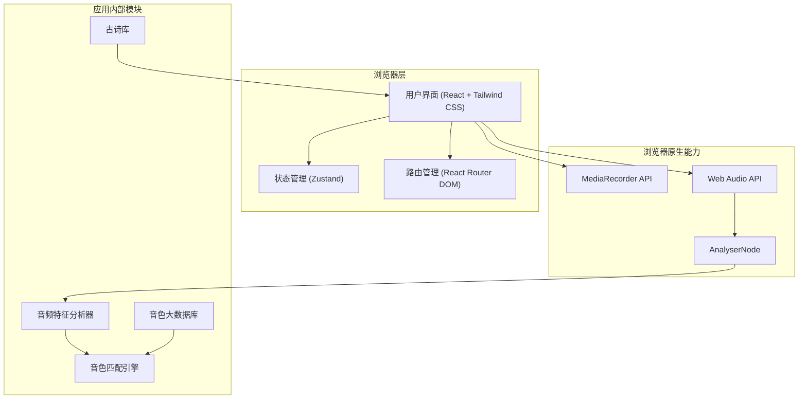

# 技术架构文档

## 1. 架构设计

本应用为纯前端单页应用（SPA），无需后端服务。所有音色数据、古诗库、判定逻辑均打包在前端代码中，通过浏览器 Web Audio API 与 MediaRecorder API 实现录音与音频特征提取。



## 2. 技术说明

- **前端框架**：React 18 + TypeScript
- **构建工具**：Vite
- **样式方案**：Tailwind CSS 3
- **状态管理**：Zustand
- **路由方案**：React Router DOM
- **图标库**：Lucide React
- **音频采集**：MediaRecorder API
- **音频分析**：Web Audio API（AnalyserNode + 自定义 FFT 分析）
- **部署方式**：静态资源托管（可直接部署到任意静态站点服务）

## 3. 路由定义

| 路由 | 用途 |
|------|------|
| `/` | 性别选择页 |
| `/recite` | 古诗朗读与录音页 |
| `/result` | 音色分析结果页 |

## 4. 数据模型

### 4.1 性别类型

```typescript
export type Gender = 'male' | 'female';
```

### 4.2 音色类型定义

```typescript
export interface VoiceType {
  id: string;
  label: string;           // 音色名称
  gender: Gender;          // 适用性别
  rarity: number;          // 稀有度 1-5
  features: string;        // 核心特征描述
  reason: string;          // 判断理由模板
  musicStyles: string[];   // 适合音乐类型
  tags: string[];          // 形象标签
}
```

### 4.3 古诗类型定义

```typescript
export interface Poem {
  id: string;
  title: string;   // 诗名
  author: string;  // 作者
  content: string[]; // 诗句数组
}
```

### 4.4 音频特征类型定义

```typescript
export interface AudioFeatures {
  averagePitch: number;        // 平均基频（Hz）
  pitchVariance: number;       // 基频方差
  speakingRate: number;        // 语速（字/秒，通过录音时长估算）
  energy: number;              // 平均能量（RMS 归一化）
  spectralCentroid: number;    // 频谱重心
  harmonicComplexity: number;  // 泛音丰富度
  jitter: number;              // 时域抖动
}
```

### 4.5 分析结果类型定义

```typescript
export interface AnalysisResult {
  voiceType: VoiceType;
  features: AudioFeatures;
  recordingDuration: number; // 录音时长（秒）
}
```

## 5. 音色匹配引擎逻辑

匹配引擎根据音频特征在对应性别音色库中寻找最匹配的类型，规则如下：

1. **基频优先**：根据 `averagePitch` 将候选音色划分为低音、中音、高音三类。
2. **能量加权**：`energy` 高且 `spectralCentroid` 低 → 厚重/磁性；`energy` 低且 `spectralCentroid` 高 → 清亮/空灵。
3. **泛音复杂度**：`harmonicComplexity` 高 → 沙哑/烟嗓/颗粒感；低 → 纯净/温润。
4. **语速调整**：`speakingRate` 快 → 偏向活力/少年/少女；慢 → 偏向成熟/稳重。
5. **稀有度判定**：音色本身已预置稀有度，匹配成功后直接展示。

匹配算法输出一个最匹配的 `VoiceType`，并基于实际特征动态生成判断理由。

## 6. 关键技术实现说明

### 6.1 录音实现

- 使用 `navigator.mediaDevices.getUserMedia` 获取麦克风权限。
- 使用 `MediaRecorder` 录制音频，记录开始与结束时间计算录音时长。
- 同时使用 `AudioContext` + `AnalyserNode` 实时获取频域数据，用于特征分析。

### 6.2 音频特征提取

- **基频估算**：通过自相关法（autocorrelation）在时域信号中估算基频。
- **能量**：计算时域信号的均方根（RMS）。
- **频谱重心**：通过 AnalyserNode 的频域数据计算加权平均频率。
- **泛音丰富度**：通过频谱熵或高频能量占比估算。
- **时域抖动**：统计相邻周期长度差异。

### 6.3 离线可用性

- 所有数据与算法均运行在前端，无需网络请求（除字体/图标外）。
- 录音数据仅用于即时分析，不上传服务器，保护用户隐私。
